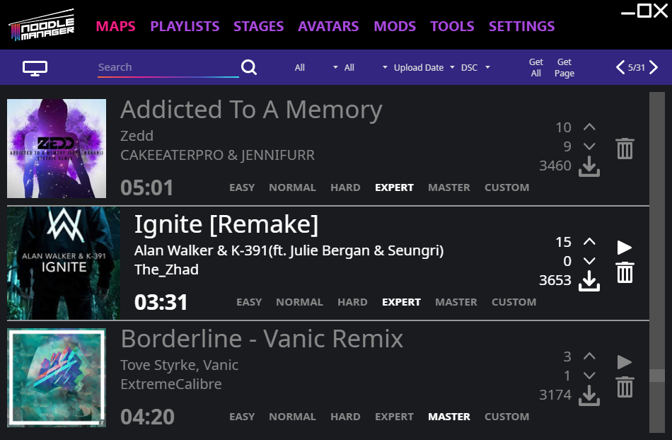

# NoodleManagerX

This is a standalone app to download Synth Riders custom content for PC and Quest. 
Other android based headsets should also work but have not been tested. 
A version for Mac and Linux is being worked on.

### [Click to download](https://github.com/tommaier123/NoodleManagerX/releases/latest) and check out the [Wiki](https://github.com/tommaier123/NoodleManagerX/wiki) on how to install or use the NoodleManagerX

## Features:
- Quest support over MTP, no developer mode necessary (should also work for other android based headsets)
- Pagination (access all songs)
- Searching, sorting and filtering
- Improved speed due to multi-threading
- Progress bar for downloads
- Multi download with get page and get all
- Blacklist
- Audio preview
- Removing corrupted maps automatically
- Redownloading updated maps automatically
- Map timestamps are set so the ordering in game is correct (only on PC)
- Auto updating
- Fixed all known bugs of the old NoodleManager

## Beta Features
- Playlists
- Avatars
- Stages
- Mods

## Work in progress:
- Cross-platform 70%
