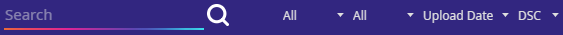

# NoodleManagerX
This is a standalone app to download Synth Riders custom content for PC and Quest. 
Other android based headsets should also work but have not been tested. 
A version for Mac and Linux is being worked on.

## Installation
Simply download and run the NoodleManagerX.exe from the [latest release](https://github.com/tommaier123/NoodleManagerX/releases/latest)

## Updating
The NoodleManagerX will notify you when a new version is available. You can choose to update automatically or manually download the update.

If you have put the NoodleManager.exe in a location that requires special privileges such as the programs folder you will be prompted to run the update with administrator privileges.

There are options in the settings to disable updates and to opt in to beta versions.

## Setup
### PC
If you are using the NoodleManagerX to download content for PC you will need to provide the path to the game installation folder. 
In most cases it should be found automatically but if you need to change it there is an option in the settings.
The PC is connected when you see a monitor icon in the top left.

For special usecases there is an option in the settings to disable the path check. Then the NoodleManagerX won't check if the directory is an actuall SynthRiders installation.

### Quest
The NoodleManagerX uses MTP not ADB like most other applications, therefore **developer mode is not necessary**.

For best results first connect the Quest to the PC using a USB data cable. Then you will get a notification on the headset where you have to allow storage access.
**You need to allow access every time**.
After that you can start the NoodleManagerX.
The Quest is connected when you see a quest icon in the top left.

**Do not unplug the quest while the NoodleManagerX is connected!**

### First Use
When you start the NoodleManagerX for the first time it will create a database of all songs you have already installed. 
Especially on Quest this can take a few minutes.

Some maps that were downloaded a long time ago won't have the correct metadata. 
To avoid duplicate maps you will get a prompt to delete them. **It will also delete all maps that were not downloaded from SynthRiderz.com.**
This will only happen once, afterwards you can add back unpublished maps/maps from other sources without causing any issues.

### Switching between Quest and PC
If you didn't connect the quest before starting the NoodleManagerX or if you want to disconnect you can click on the quest/pc icon. 
It will turn grey while the connection status is changing. Once it is white you can download content again.

## General Use
### Pagination
Only 60 maps are shown at a time. You can use the forward and back buttons to go through the pages.

### Search, Sort and Filter
There are different options for searching, sorting and filtering maps by artist, mapper, difficulty, rating, ...

### Downloading
All the maps with grey text are downloaded, the ones with white text are not.
You can download a map by clicking the download icon.
It will turn grey while a map is downloading.

### Get Page
This will download all the maps on the current page.
If you only need the latest maps you should use this. 
It is faster than Get All and it takes the search and filtering options into account.

### Get All
Gets all the maps and ignores the search and filtering options.
This should not be used to regularly update your maps. Use GetPage instead.

### Deleting
Use the delete button to delete maps.

### Blacklist
If you want to avoid redownloading deleted maps with get all or get page you can blacklist them. To do that click the delete button on an already deleted map.

### Preview
You can click the play button to listen to a song before downloading it. 
This only works for maps that have a youtube video linked. 
There is a volume slider in the settings.

### Progress Bar
There is a green progress bar, that will show progress on downloads and other operations. You can hover over it to see additional information.

### Tool Tips
If you are unsure what something does try hovering over it with the mouse. Almost all options and buttons will show a tooltip after a little while.

## Features:
- Quest support over MTP, no developer mode necessary (should also work for other android based headsets)
- Pagination (access all songs)
- Searching, sorting and filtering
- Improved speed due to multi-threading
- Progress bar for downloads
- Multi download with get page and get all
- Blacklist
- Play preview audio
- Removing corrupted maps automatically
- Redownloading updated maps automatically
- Map timestamps are set so the ordering in game is correct (only on PC)
- Auto updating
- Fixed all known bugs of the old NoodleManager

## Work in progress:
- Avatars, Playlists 90%
- Stages 70%
- Cross-platform 70%
